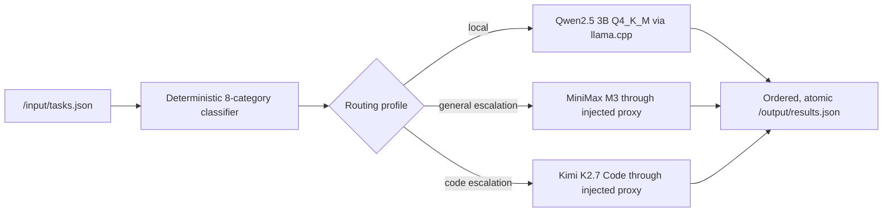

# ZeroToken Router

ZeroToken Router is a zero-token-first general-purpose AI agent for Track 1 of the AMD Developer Hackathon: ACT II. It answers suitable tasks with a bundled local Qwen model and escalates only the categories that need a stronger Fireworks model.

The scorer contract is intentionally small:

- read `/input/tasks.json` on startup;
- write `/output/results.json` before exiting;
- use only model IDs supplied in `ALLOWED_MODELS`;
- route every Fireworks call through `FIREWORKS_BASE_URL`;
- remain inside 4 GB RAM, 2 vCPU, 10 minutes, and a 10 GB compressed image.

## Architecture



The classifier is local and deterministic; routing itself spends no Fireworks tokens. Remote tasks run with a maximum of three concurrent requests while the single local model runs sequentially. A remote failure falls back to the local model without breaking the output schema.

## Routing profiles

| Profile | Behaviour | Use |
| --- | --- | --- |
| `safe` | MiniMax for non-code, Kimi for code | Accuracy-first submission and API validation |
| `hybrid` | Local sentiment, summarization, NER, and simple math; selective escalation elsewhere | Primary competition profile |
| `local` | All eight categories use bundled Qwen | Experimental zero-Fireworks-token profile |

`hybrid` is the image default. Set `ROUTING_PROFILE` only for controlled experiments.

## Runtime environment

The grading harness supplies:

```text
FIREWORKS_API_KEY
FIREWORKS_BASE_URL
ALLOWED_MODELS
```

The agent never logs the key and refuses to call a model missing from `ALLOWED_MODELS`. For local development copy `.env.example` to `.env`, but never commit the resulting file.

## Development

Python 3.11+:

```bash
python -m venv .venv
source .venv/bin/activate
pip install -r requirements-dev.txt
pytest
```

PowerShell activation:

```powershell
python -m venv .venv
.\.venv\Scripts\Activate.ps1
pip install -r requirements-dev.txt
pytest
```

Download the pinned 2.1 GB GGUF for local-model evaluation:

```bash
python scripts/download_model.py
```

The model URL is pinned to Hugging Face revision `7dabda4d13d513e3e842b20f0d435c732f172cbe`
and verified against SHA-256 `626b4a6678b86442240e33df819e00132d3ba7dddfe1cdc4fbb18e0a9615c62d`.

## Mock Fireworks integration

Start the local OpenAI-compatible mock:

```bash
python tools/mock_fireworks_server.py --port 8089
```

In a second terminal:

```bash
export FIREWORKS_API_KEY=mock-key
export FIREWORKS_BASE_URL=http://127.0.0.1:8089/inference/v1
export ALLOWED_MODELS=minimax-m3,kimi-k2p7-code
export ROUTING_PROFILE=safe
export INPUT_PATH=data/practice_tasks.json
export OUTPUT_PATH=output/results.json
python -m tokenrouter.agent
```

Use `$env:NAME="value"` for the equivalent PowerShell environment assignments.

## Docker

The Dockerfile downloads and verifies the official Qwen GGUF during the build and installs a pinned CPU-only llama.cpp wheel.

```bash
docker build --platform linux/amd64 -t zero-token-router:hybrid .
mkdir -p output
docker run --rm --memory=4g --cpus=2 \
  -v "$PWD/data/practice_tasks.json:/input/tasks.json:ro" \
  -v "$PWD/output:/output" \
  -e FIREWORKS_API_KEY \
  -e FIREWORKS_BASE_URL \
  -e ALLOWED_MODELS \
  zero-token-router:hybrid
```

Do not bundle `.env` or a personal API key in the image. GitHub Actions publishes only `linux/amd64` to GHCR and disables provenance so the registry tag resolves directly to the required platform manifest.

## Evaluation

The repository contains the eight official practice shapes and a 19-task local regression set:

```bash
python -m tokenrouter.agent
python scripts/evaluate.py \
  --tasks data/simulated_eval.json \
  --results output/results.json \
  --required 17
```

This local evaluator is a regression gate, not a substitute for the official LLM judge. Promote a category from Fireworks to local only after it reaches at least 90% on held-out variants with no formatting failures.

## Publishing and submission

1. Push the repository publicly to GitHub.
2. Run **Publish linux-amd64 image** in GitHub Actions.
3. Make the resulting GHCR package public.
4. Confirm an anonymous `docker pull` succeeds.
5. Submit the immutable tag or digest, not an untracked local image.

Submission support files are in `docs/`: a five-slide outline, demo script, and an optional static GitHub Pages site. A paid live inference endpoint is not required.

## Licenses

- Project code: MIT, see [LICENSE](LICENSE).
- Qwen2.5-3B-Instruct-GGUF: Apache-2.0; weights are downloaded from the official [Qwen repository](https://huggingface.co/Qwen/Qwen2.5-3B-Instruct-GGUF).
- llama.cpp and llama-cpp-python retain their upstream licenses.
