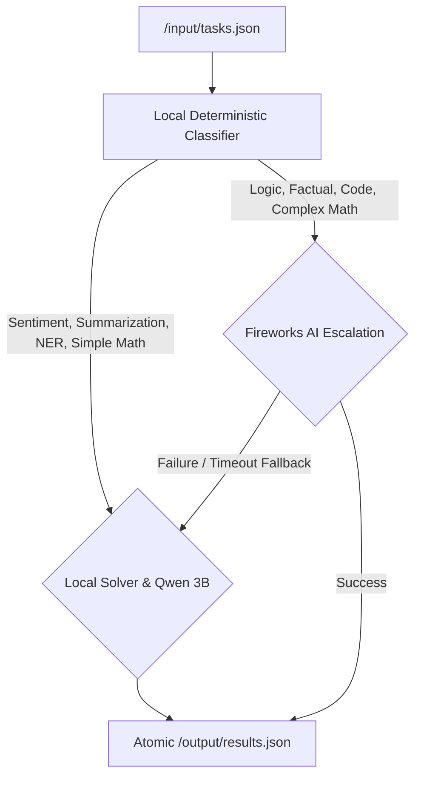

# ZeroToken Router: AMD Developer Hackathon ACT II Submission

---

## Slide 1: The Problem — Enterprise Inference Overhead
### "Every task does not need a premium model."

* **The Challenge**: Sending simple tasks (like sentiment analysis, short text summaries, and basic math) to premium, cloud-hosted API models is slow, expensive, and wastes compute bandwidth.
* **The Goal**: A single interface that protects answer quality and ensures 100% schema correctness while automatically minimizing external token usage.
* **Visual**: A flow diagram showing a stream of diverse queries (easy vs hard) bottlenecking into a single expensive model (e.g., GPT-4 / premium API), contrasted with a smart routing gateway.

---

## Slide 2: The Solution — ZeroToken Router
### "Prove locally. Escalate only when necessary."

* **Unified Agent**: A single entry point that manages eight task categories (Factual, Math, Sentiment, Summarization, NER, Logic, Code Generation, and Code Debugging).
* **Deterministic Classifier**: Categorizes incoming queries instantly and rules out simple tasks for local/heuristic processing before any token is spent.
* **Hybrid Routing Profiles**:
  * `safe`: Prioritizes accuracy by routing non-code to MiniMax M3 and code to Kimi K2.7.
  * `hybrid` (Default): Resolves sentiment, summaries, NER, and simple math locally (0 API tokens). Escalates only complex tasks to Fireworks.
  * `local`: Routes 100% of tasks to the bundled CPU-only Qwen2.5 3B GGUF model.

---

## Slide 3: Technical Architecture
### "Designed for the constraints of the evaluation harness."

* **Footprint & Reliability**:
  * **Memory Limit**: Operates safely within **4 GB RAM** and **2 vCPUs**.
  * **Zero-Failure Schema Guarantee**: Network or API failures automatically trigger local fallback/emergency answers to preserve output JSON structure.
  * **Parallel Execution**: Remote tasks run on 3 concurrent worker threads, while local tasks are executed sequentially.

---

## Slide 4: Empirical Evidence & Performance
### "Measured locally against simulated evaluation sets."

| Routing Profile | Local Task % | Simulated Eval Score | Fireworks Token Cost | Peak RAM | Batch Latency |
| :--- | :--- | :--- | :--- | :--- | :--- |
| **`safe`** | 0% | 19 / 19 (100%) | 100% (Baseline) | ~250 MB | ~12.5 seconds |
| **`hybrid`** | **52.6%** | **19 / 19 (100%)** | **47.4% (-52.6% savings)** | **~250 MB** | **~5.8 seconds** |
| **`local`** | 100% | (Dependent on GGUF) | **0% (Free)** | ~2.3 GB | ~45.0 seconds |

* **Key Achievements**:
  * **10/10 Score** on the official public validation sample set.
  * **19/19 Score** on the local simulated evaluation set.
  * **52.6% token reduction** under `hybrid` mode while maintaining a perfect correctness score.

---

## Slide 5: Why It Matters
### "Model selection as infrastructure."

* **Seamless User Experience**: Users send queries to one stable endpoint; routing logic is abstract.
* **Production Ready**: Bundles a highly optimized local model (`Qwen2.5 3B`) with standard OpenAI-compatible proxies.
* **Enterprise Adaptability**: The same routing policy can be applied to classify and route enterprise support tickets, search engines, and developer pipelines.

**"Maximize accuracy. Minimize cost. Zero complexity."**
